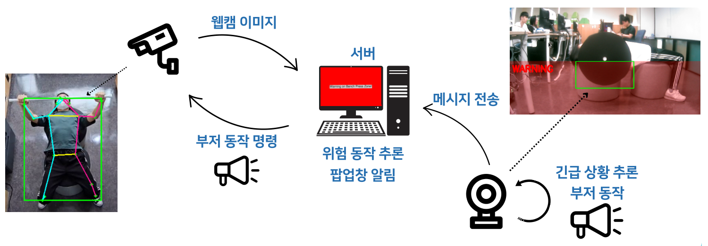
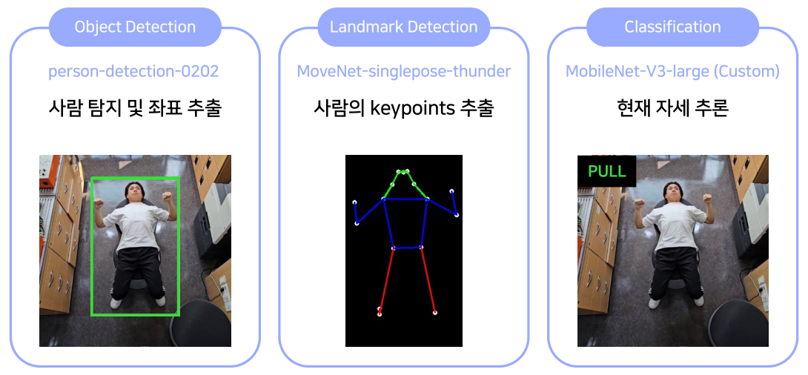
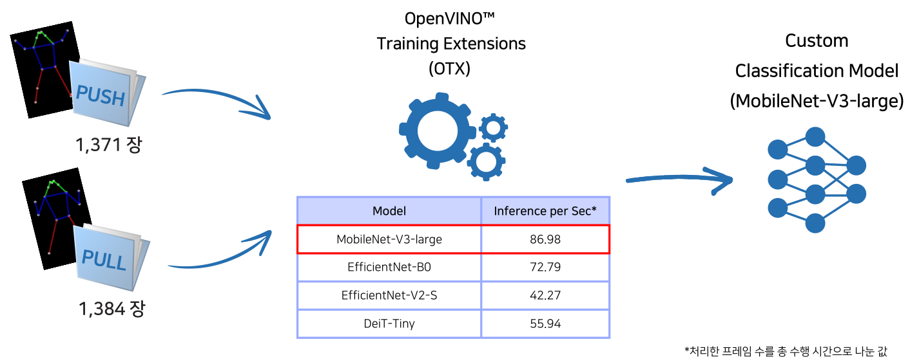
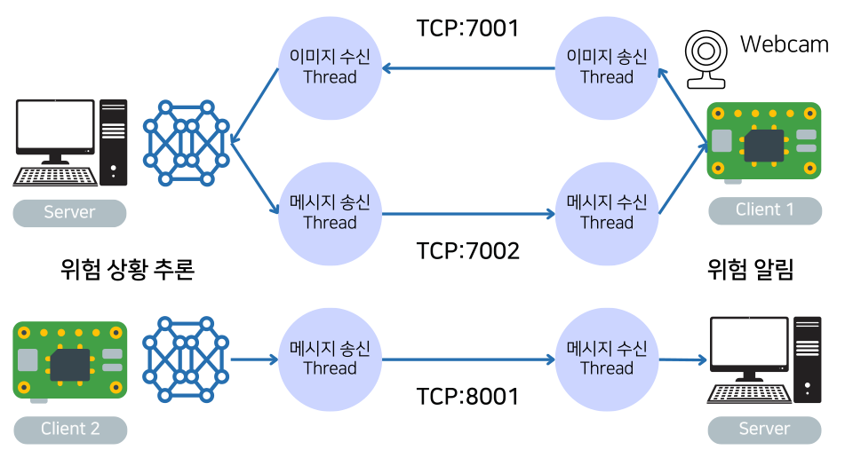

# Bench Safety Project

인텔 엣지 AI SW 아카데미 4기 - 엣지 AI 실무 프로젝트

## 프로젝트 정보

### 개요

- 벤치프레스 운동 도중 발생할 수 있는 위험 상황을 감지하여 사고를 예방하는 시스템.
- 다음 두 가지 상황이 발생할 경우, 이를 감지하고 관리자에게 알림을 보내는 시스템을 만드는 것을 목표로 하였다.
    - 위험 상황: 바벨을 다시 들어올리지 못해 바벨에 깔린 상황
    - 긴급 상황: 바벨을 놓쳐 목 부근으로 떨어진 상황
- 두 개의 raspberry pi가 서버와 TCP 소켓으로 연결하여 통신하며, 하나는 위험 상황, 다른 하나는 긴급 상황을 감지한다.

### 정보

- 기간: 2024. 06. 17 ~ 2024. 07. 02
- 프로젝트 사용 기술
    - Raspberry Pi, Ubuntu PC
    - Python, OpenVino, TensorFlow, PyTorch, YOLOv5
- 담당 역할
    - 자세 분류 모델 생성
    - 서버 구축
- Github: [Link](https://github.com/jd6286/BSP_BenchSafetyProject)
- Presentation: [Link](https://github.com/kccistc/intel-04/blob/main/doc/project/Team_7/Team_%EA%B0%80%EC%98%A4%EA%B0%80%EC%9D%B4%EA%B1%B0.pdf)

## 수행 내용

### 자세 분류 모델 생성

위험 상황 감지에 사용할 자세 분류 모델을 OTX를 이용해 학습했다.

이 프로젝트에서 위험상황은 “벤치프레스를 하다 힘이 빠져, 바벨을 내린 상태에서 다시 들어올리지 못하는 상태”라 정의하였다. 이를 위해 자세를 미는 자세(PUSH)와 당기는 자세(PULL) 두 가지로 분류하기로 했다.

자세 분류는 다음 세 가지 단계를 거친다. 각 항목 안의 내용은 사용된 모델과 수행하는 작업이다.

- Object Detection: 영상에서 사람이 위치한 영역을 찾아내 ROI로 설정
- Landmark Detection: 신체의 각 지점(landmark)를 찾아낸 다음 연결해서 이미지를 생성
- Classification: Landmark Detection에서 생성한 이미지를 이용해 현재 자세를 추론

벤치프레스를 하는 영상을 촬영한 후, 영상에 Landmark Detection을 수행했다. 수행 결과로 나온 이미지들을 PUSH 자세와 PULL 자세로 분류한 다음, OTX를 이용해서 분류한 이미지들을 학습 시켜 Classification 모델을 생성하였다.

- OpenVINO: Intel에서 개발한 딥 러닝 모델 최적화 및 배포를 위한 소프트웨어 툴킷
- OTX(OpenVINO Training Extensions): 쉽게 OpenVINO 모델을 학습, 최적화, 배포할 수 있는 프레임워크

### 서버 구축

서버는 Ubuntu 20.04 PC에서 Python으로 작성하였다.

서버의 역할은 다음과 같다:

- 라즈베리 파이에 프로그램 시작 명령을 전달
- 상단에 설치된 raspberry pi로부터 카메라 영상을 수신하여 위험 상황을 감지 작업을 수행
- 긴급 상황을 감지하는 raspberry pi로부터 알림 메시지를 수신

서버는 raspberry pi와 TCP 소켓 통신으로 데이터를 주고 받는다. Python의 socket 모듈을 사용하였다.

이미지 수신, 메시지 송수신, 자세 분류를 동시에 수행하기 위해서 Python의 threading 모듈을 사용하였다.

- 이미지 수신 thread (Client1 → Server)
- 메시지 수신 thread (Client1 → Server)
- OpenVINO 추론은 메인 루프에서 처리