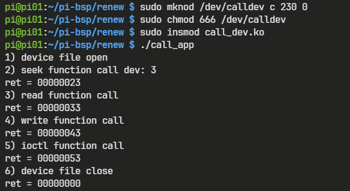

# 문자 디바이스 드라이버

## 문자 디바이스 드라이버 동작

사용자의 응용 프로그램에서 디바이스 파일에 저수준 입출력 함수로 접근하면, 그에 대응하는 디바이스 드라이버에서 정의된 함수를 호출하여 하드웨어를 제어한다. 그 후 결과를 응용 프로그램 쪽으로 전달한다.

1. 응용 프로그램이 디바이스 파일을 `open()` 함수로 연다.
2. 디바이스 파일의 타입 정보, 주 번호를 이용하여 디바이스 드라이버 인덱스를 얻는다.
3. 디바이스 드라이버 인덱스를 이용하여 file_operations 구조체 주소를 얻는다.
4. file_operations에 등록된 함수들을 이용하여 하드웨어를 제어한다.

## file_operations 구조체

file_operations 구조체는 디바이스 파일을 조작하는 방법을 담고 있는 구조체다.

응용 프로그램에서 저수준 파일 입출력 함수를 이용해 디바이스 파일에 접근하면, file_operations 구조체에 등록된 대응되는 함수를 호출한다.

`*owner` 를 제외한 구조체의 모든 필드는 함수 포인터다.

```c
/* linux/fs.h */
struct file_operations {
  struct module *owner;
  loff_t (*llseek) (struct file *, loff_t, int);
  ssize_t (*read) (struct file *, char __user *, size_t, loff_t *);
  ssize_t (*write) (struct file *, const char __user *, size_t, loff_t *);
  long (*unlocked_ioctl) (struct file *, unsigned int, unsigned long);
  int (*open) (struct inode *, struct file *);
  int (*release) (struct inode *, struct file *);
  ...
} __randomize_layout;
```

### 저수준 입출력 함수와 구조체 필드

다음은 저수준 파일 입출력 함수와 대응하는 구조체 필드의 정보다.

저수준 입출력 함수와 구조체 함수 포인터의 매개변수의 관계를 나타내며, 각 함수는 사용자가 직접 구현한 후, file_operations 구조체를 생성하여 등록한다.

**open()**

저수준 입출력 함수 open()의 filepath와 flags는 내부적으로 처리된 후 file operations의 inode와 filp에 전달된다.

file operations의 open()은 정상적으로 수행된 경우 0을 반환한다.

```c
// 저수준 입출력 함수
fd = open(const char *filepath, int flags);
// file operations
int open(struct inode *inode, struct file filp*)
{
  ...
  return ret;
}
```

**close()**

```c
// 저수준 입출력 함수
ret = close(int fd);
// file operations
int release(struct inode *inode, struct file *filp)
{
  ...
  return ret;
}
```

**read()**

저수준 입출력 함수 read()의 buf에는 버퍼의 주소가 들어가며, file operations의 buf에 전달된다. 저수준 입출력 함수는 파일 포인터가 커널 내부에서 관리가 되나, file operations의 함수는 파일 포인터 f_pos의 값을 처리해야 한다.

```c
// 저수준 입출력 함수
ret = read(int fd, void *buf, size_t count);
// file operations
ssize_t (*read) (struct file *filp, char __user *buf, size_t count, loff_t *f_pos)
{
  ...
  return ret;
}
```

**write()**

```c
// 저수준 입출력 함수
ret = write(int fd, const void *buf, size_t count);
// file operations
ssize_t (*write) (struct file *filp, const char __user *buf, size_t count, loff_t *f_pos)
{
  ...
  return ret;
}
```

**lseek()**

파일 포인터의 위치를 옮기는 함수

```c
// 저수준 입출력 함수
ret = lseek(int fd, off_t offset, int whence);
// file operations
loff_t llseek(struct file *filp, loff_t off, int whence)
{
  ...
  return ret;
}
```

**ioctl()**

ioctl() 함수는 read, write 외에 다른 작업을 수행할 때 사용한다.

unlocked_ioctl() 함수의 매개변수 중 cmd는 명령의 번호, arg는 매개변수의 주소값이다.

```c
// 저수준 입출력 함수
ret = ioctl(int fd, int request, ...);
// file operations
long (*unlocked_ioctl) (struct file *filp, unsigned int cmd, unsigned long arg)
{
  ...
  return ret;
}
```

## 문자 디바이스 드라이버 등록

다음은 문자 디바이스 드라이버의 예시이다.

```c
#include <linux/init.h>
#include <linux/module.h>
#include <linux/kernel.h>
#include <linux/fs.h>

#define DEV_NAME  mydev
#define DEV_MAJOR 230

static struct file_operations call_fops {
  .owner = THIS_MODULE,
  .open = dev_open,
  ...
};

static int dev_init(void)
{
  int ret;
  ret = register_chrdev(DEV_NAME, DEV_MAJOR, &call_fops);
  return ret;
}

static void dev_exit(void)
{
  unregister_chrdev(DEV_MAJOR, DEV_NAME);
}
```

 문자 디바이스 드라이버를 등록한다는 것은 `mknod` 명령어로 생성한 디바이스 파일에 file_operations 구조체를 등록한다는 의미이다.

`register_chrdev()` 함수를 호출하면, 인자로 넘긴 장치명, 주 번호와 일치하는 디바이스 파일에 file_operations 구조체를 연결한다.

`unregister_chrdev()` 함수는 디바이스 드라이버의 등록을 해제한다.

### 예시 프로그램

디파이스 파일을 불러와서 저수준 입출력 함수를 호출하는 프로그램이다.

- 디바이스 파일
    
    [call_dev.c](files/call_dev.c)
    
- 응용 프로그램
    
    [call_app.c](files/call_app.c)
    
- Makefile
    
    [Makefile](files/Makefile.txt)
    

mknod 명령어로 디바이스 파일을 `/dev/calldev` 이름으로 생성하고 진행한다.

```bash
sudo mknod /dev/calldev c 230 0
sudo chmod 666 /dev/calldev
```

