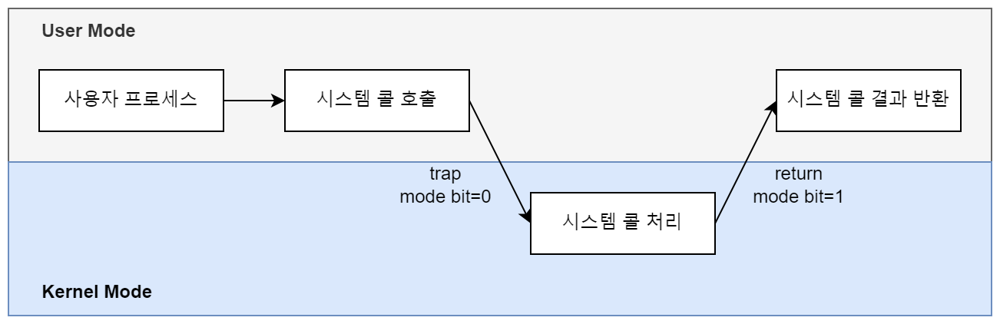

# 시스템 콜

## 시스템 콜(System call)

### 시스템 콜

- 응용 프로그램이 커널 영역의 기능을 사용할 수 있도록 운영체제에서 제공하는 인터페이스.
- 커널 모드(Kernel Mode)
    - 운영체제가 CPU를 사용하는 모드.
    - 메모리의 모든 영역에 접근 가능
    - I/O 수행 및 하드웨어 제어 가능
- 사용자 모드(User Mode)
    - 사용자의 응용 프로그램이 실행되는 모드.
    - 접근 가능한 메모리 영역이 제한되어 있음.
    - 하드웨어 제어가 불가능하며, 기능을 수행하기 위해서는 시스템 콜 호출이 필요.

### 시스템 콜 처리 절차



## 사용자 시스템 콜 등록

### 시스템 콜 등록

1. System call 번호 할당
    
    `include/uapi/asm-generic/unistd.h` 파일 수정
    
    ```c
    // 추가
    #define __NR_mysyscall 451
    __SYSCALL(__NR_mysyscall, sys_mysyscall)
    
    // 한 칸 다음으로 번호 변경
    #undef __NR_syscalls
    #define __NR_syscalls 452
    ```
    
2. System call 호출 테이블 등록
    
    `arch/arm/tools/syscall.tbl` 파일 수정
    
    ```c
    // 최하단에 추가
    451 common  mysyscall    sys_mysyscall
    ```
    
3. System call 함수 원형 등록
    
    `include/linux/syscalls.h` 파일 수정
    
    ```c
     long sys_mysyscall(long val);
    ```
    
4. System call 함수 구현
    
    `kernel/test_mysyscall.c` 파일 생성
    
    ```c
    #include <linux/kernel.h>
    
    long sys_mysyscall(long val)
    {
      printk(KERN_INFO "mysyscall value = %ld\n", val);
      return val * val;
    }
    ```
    
5. Makefile 수정
    
    `kernel/Makefile` 파일 수정
    
    ```makefile
    # 아래 내용 추가, 또는 obj-y 뒤에 test_mysyscall.o 추가
    obj-y += test_mysyscall.o
    ```
    
6. 커널 컴파일

### 시스템 콜 호출

컴파일 한 커널 이미지와 `include/asm-generic/unistd.h` 파일을 라즈베리 파이로 옮긴다.

그 후, 다음 시스템 콜을 호출하는 프로그램을 작성하여 실행해본다.

```c
#include <stdio.h>
#include <unistd.h>
#include <asm-generic/unistd.h>
#pragma GCC diagnostic ignored "-Wunused-result"

int main()
{
    long val;

    printf("input value = ");
    scanf("%ld", &val);
    val = syscall(__NR_mysyscall, val);  // system call

    if (val < 0) {
        perror("syscall");
        return 1;
    }   

    printf("mysyscall return value = %ld\n", val);

    return 0;
}
```

## GPIO 제어

리눅스 커널에는 표준 GPIO API가 존재한다.

`kernel/gpio.h` 를 include하여 API를 호출할 수 있다.

```c
// GPIO 사용
int gpio_request(unsigned int gpio, const char *label);
// GPIO 반환
void gpio_free(unsigned int gpio);
// GPIO를 입력으로 사용
int gpio_direction_input(unsigned int gpio);
// GPIO를 출력으로 사용
int gpio_direction_output(unsigned int gpio, int value);
// 값 설정
void gpio_set_value(unsigned int gpio, int value);
// 값 읽기
int gpio_get_value(unsigned int gpio);
// GPIO에 interrupt 기능을 활성화, IRQ(Interrupt Request) 번호를 반환.
int gpio_to_irq(unsigned int gpio);
// GPIO에 interrupt 기능을 해제.
void free_irq(unsigned int irq, void *dev_id);
```