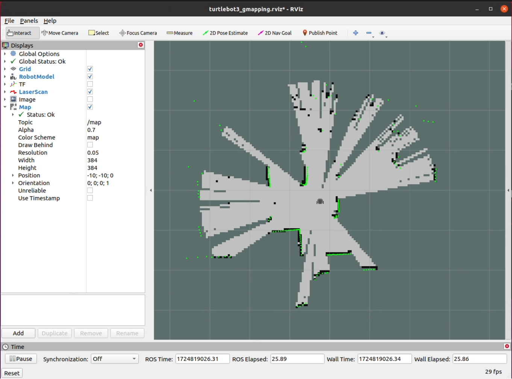
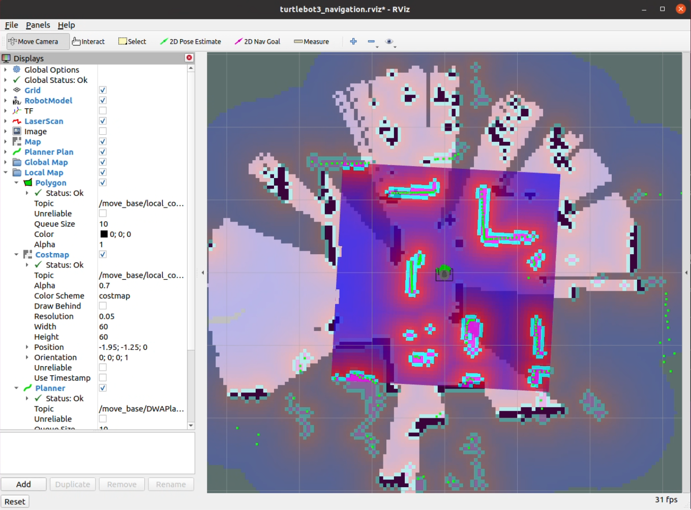
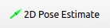
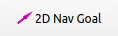

# SLAM & Navigation

## SLAM

Simultaneous Localization And Mapping

터틀봇에 장착된 LiDAR 센서를 이용하여 지도를 생성한다.

### 실행

PC에서 roscore 실행, 터틀봇에서 bringup 이후에 진행한다.

```bash
roslaunch turtlebot3_slam turtlebot3_slam.launch
```

RViz가 실행되며 화면에 스캔 된 지도가 표시된다.



좌측 하단의 Reset 버튼을 눌러 현재 위치를 기준으로 초기화 할 수 있다.

teleoperation을 실행하여 터틀봇을 이동시키며 지도를 생성한다. 터틀봇을 들어서 직접 이동시킬 경우 좌표가 틀어질 가능성이 있으므로, 키보드 또는 컨트롤러를 이용해서만 이동시킨다.

생성된 지도를 저장하려면 다음 명령을 입력한다.

```bash
rosrun map_server map_saver -f <파일 경로>
# rosrun map_server map_saver -f ~/test_map
```

해당 경로에 .pmg 파일과 .yaml 파일이 생성된다.
(예: test_map.pmg, test_map.yaml)

## Navigation

SLAM으로 생성한 지도를 이용해서 지정한 위치로 자율 주행하는 기능을 수행한다.

### 실행

teleoperation이 실행 중일 경우 종료한다.

```bash
roslaunch turtlebot3_navigation turtlebot3_navigation.launch map_file:=<yaml 파일 절대 경로>
# roslaunch turtlebot3_navigation turtlebot3_navigation.launch map_file:=$HOME/test_map.yaml
```

RViz가 실행되며 불러온 지도의 모습과 LiDAR 센서로 스캔 중인 벽의 경계가 표시된다.



Navigation이 시작되면 터틀봇은 지도 상의 벽과 현재 감지되는 벽의 mapping을 시도한다. 정확한 mapping을 위해서 현재 터틀봇의 위치와 방향을 지정해야 한다.



2D Pose Estimate 버튼을 누른 후, RViz의 지도 상에서 현재 위치를 클릭 & 드래그 하여 위치와 방향을 초기화한다. 지도 상의 벽과 LiDAR 센서의 벽(초록색 점)이 일치하게 한다.



위치 초기화가 완료되면 2D Nav Goal 버튼을 누른 후, RViz 지도 상에서 목적지를 클릭 & 드래그 하여 목적지를 지정한다.

목적지가 지정되면 터틀봇은 스스로 경로를 생성하여 이동한다.