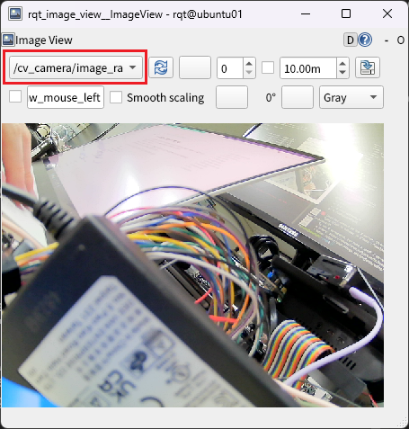
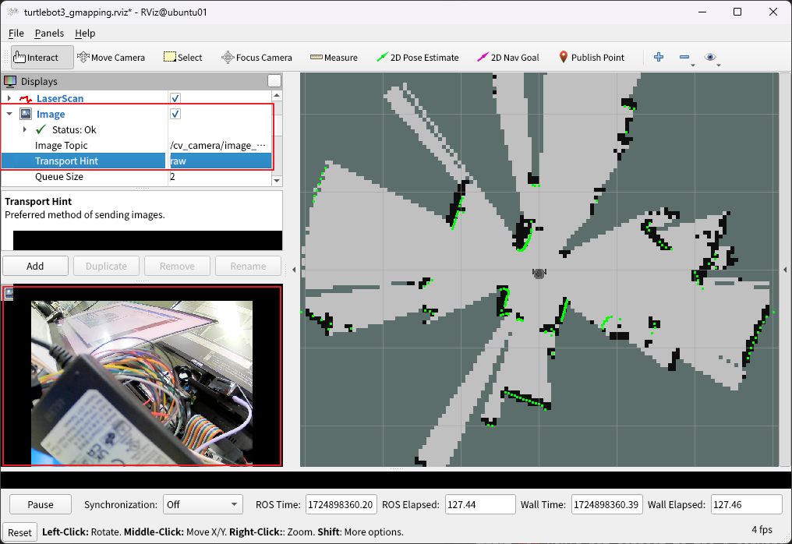

# 카메라

## 실행

터틀봇에 다음 패키지를 설치한다.

```bash
# 20.04 Noetic 기준
sudo apt install ros-noetic-cv-camera
```

USB 카메라를 연결한 다음, 아래 명령어를 입력하여 카메라 노드를 실행한다.

```bash
rosrun cv_camera cv_camera_node
```

## 확인

### RQt

다음 명령어를 입력하여 RQt ImageView를 실행한다.

```bash
rqt_image_view
```

상단의 드롭다운 메뉴를 클릭한 후 연결된 카메라를 선택한다.



### RViz

slam 또는 navigation 실행 명령어를 입력하여 RViz를 실행한다.

프로그램이 실행되면 좌측 메뉴에서 Display-Image에 체크한 후, 다음을 설정한다.

- Image Topic: 연결된 카메라
- Transport Hint: raw

